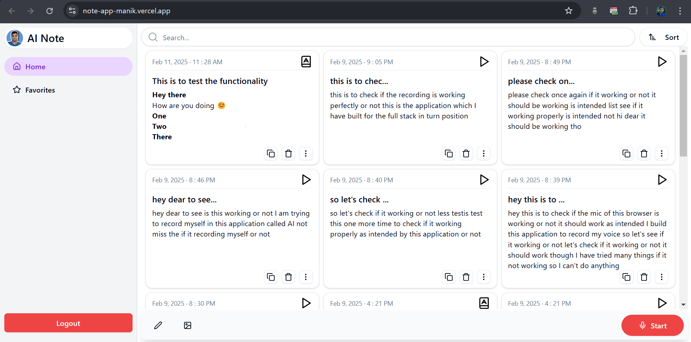

<div align="center">
    
    <h1>Note App</h1>
</div>

**Note App** is a modern, feature-rich note-taking application built using the MERN stack (MongoDB, Express.js, React.js, Node.js). It allows users to create, manage, and organize notes efficiently. With features like voice-to-text notes, rich text editing, and advanced search, it provides a seamless experience for users to capture and manage their thoughts.📝

---

## Features

- **User Authentication**: Users can sign up and log in securely using JWT-based authentication.
- **Create Notes**: Users can create notes by typing or using voice-to-text functionality.
- **Instant Note Display**: Notes are displayed instantly after creation.
- **Edit Notes**: Users can edit note content, title, and upload images using a rich text editor (TipTap).
- **Delete and Copy Notes**: Notes can be deleted or copied with a single click.
- **Favorite Notes**: Users can mark notes as favorites for quick access.
- **Full-Screen Mode**: Notes can be viewed in full-screen mode for better readability.
- **Voice Notes**: Users can view their voice recordings and transcripts.
- **Advanced Search**: Users can search for notes based on title or content and sort them.
- **Responsive UI**: The app is fully responsive and works seamlessly across devices.

---

## Tech Stack

### Frontend

- **Framework & Routing**: `ReactJS`, `React Router Dom`
- **Styling**: `TailwindCSS`, `ShadCN`
- **State Management**: `Zustand`
- **API Communication**: `Axios`, `React Query`
- **Rich Text Editor**: `TipTap`
- **Design Principles**: Atomic Design (Atoms, Molecules, Organisms)
- **Architecture**: Hook-based architecture with reusable custom hooks

### Backend

- **Framework**: `NodeJS`, `ExpressJS`
- **Database**: `MongoDB`, `Mongoose`
- **Authentication**: `JWT`, `Bcrypt`
- **Validation**: `Zod`
- **Architecture**: Modular architecture with separate folders for routes, controllers, middlewares, and schemas

---

## Preview Images



## Installation and Setup

### Prerequisites

- Node.js and npm/yarn installed.
- MongoDB database set up locally or on a cloud provider.

### Steps

1. **Clone the Repository**

   ```bash
   https://github.com/ManikMaity/Note-App.git
   cd Note-App
   ```

2. **Backend Setup**

   - Navigate to the backend directory:
     ```bash
     cd backend
     ```
   - Install dependencies:
     ```bash
     npm install
     ```
   - Create a `.env` file and add the following:
     `env
     PORT=3000
     NODE_ENV="development"
     DEV_DB_URL="your-mongodb-url"
     PROD_DB_URL=""
     SALT_ROUND=7
     JWT_SECRET="your-jwt-secret"
     JWT_EXPIRY="1y"
     `
   - Start the server:
     ```bash
     npm run dev
     ```

3. **Frontend Setup**

   - Navigate to the frontend directory:
     ```bash
     cd frontend
     ```
   - Install dependencies:
     ```bash
     npm install
     ```
   - Make a .env file and add the following:
     ```
     VITE_BACKEND_URL="http://localhost:3000"
    VITE_FIREBASE_API = "your-firebase-api-key"
     ```
   - Start the development server:
     ```bash
     npm run dev
     ```

4. **Access the Application**
   - Open a browser and go to `http://localhost:5173`.


## Links

- [Live Website](https://note-app-manik.vercel.app/)
